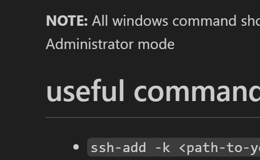
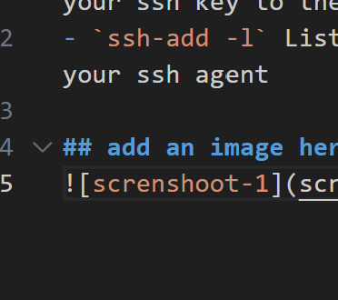

# This is a simple markdown document

# Ensure you setup ssh agent on your local machne
- [SSH Agent for Windows](https://learn.microsoft.com/en-us/windows-server/administration/openssh/openssh_install_firstuse?tabs=gui)
- [start the sssh-ahent](https://learn.microsoft.com/en-us/windows-server/administration/openssh/openssh_keymanagement)
- [SSH Agent for Linux](https://ubuntu.com/server/docs/service-openssh)

**NOTE:** All windows command should be executed in Administrator mode

# useful commands
- `ssh-add -k <path-to-your-key>` add your ssh key to the ssh agent key chain
- `ssh-add -l` List all keys added to your ssh agent 

## add an image here

